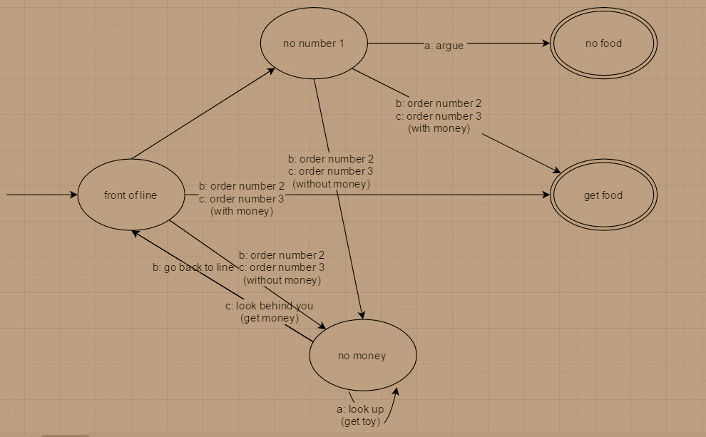

# Program \#14
Write a program in Prolog to take the user through a "quest." It can
be like an "adventure game," or something more practical and mundane
like a training exercise. More specifically, describe a scenario, then
allow them to choose what to do and describe how that affects the
situation. Repeat this process, giving the user the opportunity to
complete some task or to achieve some goal. The task or goal must
involve multiple requirements or stages, and it must involve some
cumulative total. I will give some general guidelines in class to
establish minimum requirements, but I would prefer to let you do
whatever you decide as long as it is not trivial.

In addition to the program, you are also required to give me a brief
description of the "quest." Just write a paragraph or two describing
what the user's task will be. Also, turn in graph describing the
DFA (or FSM) that you used for your program. You can turn in this
description when you turn in your program.  

### Example of Graph Given

### Graph of my Story/quest

